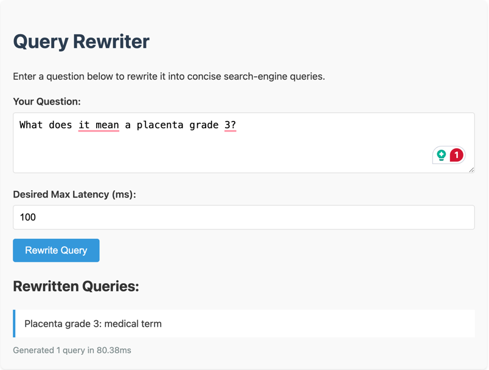

# Intro

This is my solution to [Kagi's main task assessment](https://hackmd.io/@vprelovac/rJ2G_Tx9T).

The task was to create an API where given a query, it returns one or more search queries with a maximum latency of 100 ms on a consumer grade CPU.

The problem is known as `query reformulation` or `query expansion`. The literature such as [Query Expansion by Prompting Large Language Models](https://arxiv.org/abs/2305.03653) and [Learning to Attend, Copy, and Generate for Session-Based Query Suggestion](https://arxiv.org/abs/1708.03418) give us some hints on paths to explore. The former uses LLM for the query rewrite, while the latter uses a sequence-to-sequence (seq2seq) model. I explored these two paths concurrently:

- Using seq2seq language models like `google/flan-t5-small` for fast inference, and then work towards improving the outputs, possibly through fine-tuning.
- Using powerful open-source LLMs that can provide quality answers, and then scale down and optimize latency.


If fine-tuned were to be used, I would choose MS-MARCO as the main dataset. It contains 100,000 real user queries from Bing. Since I couldn't find datasets specific for query reformulation, the next best thing would be to use MS-MARCO to retrieve original queries, and a powerful LLM (where we don't care about latency) to generate the outputs.


After a lot of trial-and-error, I had more success with the LLM path where I was able to optimize for queries to be below 100 ms while maintaining decent output quality. The stack with the final solution was:

- Python 3.12.
- llama-cpp-python.
- LLM model `Qwen/Qwen2.5-0.5B-Instruct-GGUF` with Q4_0 quantization.
- uvicorn + FastAPI.
- One-shot system prompt in XML format.

# Local installation

For best compatibility, use python 3.12.10.

````commandline
pip install -r requirements.txt
python api.py
````

This will start a server that you can make your API request at POST http://localhost:8080/rewrite

You can also quick-test a few examples by running:

````commandline
python test_api.py
````

You can also query the API through:

````commandline
curl --location 'http://localhost:8080/rewrite' \
    --header 'Content-Type: application/json' \
    --data '{
        "question": "Create a table for top noise cancelling headphones that are not expensive",
        "desired_max_latency": 100
    }'          
````

# Results

These results were performed on a:

- Macbook Pro M3 Max 48GB RAM
- Python 3.12.10
- Only collect the first call to `test_api.py` to discard possible cache gains.
- Set `n_gpu_layers` at 0 to ensure only CPU is used.

````
% python test_api.py 
Input Question: In what year was the winner of the 44th edition of the Miss World competition born?
Rewritten Queries: ['Who is the winner of the 44th edition of the Miss World']
Response Time: 98.1 ms
--------------------------------------------------
Input Question: Who lived longer, Nikola Tesla or Milutin Milankovic?
Rewritten Queries: ['Nikola Tesla', 'Milutin Milankovic']
Response Time: 80.9 ms
--------------------------------------------------
Input Question: Author David Chanoff has collaborated with a U.S. Navy admiral who served as the ambassador to the United Kingdom under which President?
Rewritten Queries: ['U.S. Navy admiral', 'U.S. President']
Response Time: 86.7 ms
--------------------------------------------------
Input Question: Create a table for top noise cancelling headphones that are not expensive
Rewritten Queries: ['Top noise cancelling headphones', 'Table of top noise cancelling headphones']
Response Time: 78.5 ms
--------------------------------------------------
Input Question: What are some ways to do fast query reformulation
Rewritten Queries: ['Fast query reformulation techniques', 'Query optimization methods', 'Query rewriting strategies']
Response Time: 85.2 ms
--------------------------------------------------
Input Question: Can you give me an easy pasta recipe?
Rewritten Queries: ['Pasta recipe', 'Easy pasta recipe', 'Pasta recipes']
Response Time: 73.3 ms
--------------------------------------------------
Input Question: What are common flu symptoms?
Rewritten Queries: ['Flu symptoms', 'Common flu symptoms', 'Flu symptoms and symptoms']
Response Time: 80.0 ms
--------------------------------------------------
Input Question: When was Taylor Swift born?
Rewritten Queries: ["Taylor Swift's birth year", "Taylor Swift's birth date"]
Response Time: 77.3 ms
--------------------------------------------------
Input Question: Who won the 2022 World Cup?
Rewritten Queries: ['2022 World Cup winner', '2022 World Cup football champions']
Response Time: 98.4 ms
--------------------------------------------------
Input Question: What does it mean a placenta grade 3?
Rewritten Queries: ['Placenta grade 3 classification', 'Placenta grade 3 definition']
Response Time: 92.9 ms
--------------------------------------------------

Process finished with exit code 0
````

The results are decent and coherent, but fluctuate in quality. For example, the question `Author David Chanoff has collaborated with a U.S. Navy admiral who served as the ambassador to the United Kingdom under which President?` got outputs `['U.S. Navy admiral', 'U.S. President']` that doesn't contain enough information to understand intent, but sometimes it would generate a better response like `U.S. Navy admiral who served as ambassador to the United Kingdom`. Turning down the temperature would reduce randomness, but the quality also decreased on average.

# Live Demo

~~Please check the [live demo](https://marco-altran.github.io/kagi-query-reformulation/)~~  *Due to costs, the live demo is no longer available.*
 This uses:

- Google Cloud Platform (GCP) Cloud Run to host the python code.
- A LLM server hosted on Huggingface endpoints
- An adapted version of `api.py` to make an API call to Huggingface instead of calling llama_cpp_python locally.

You can check the files that made up the live demo:

- `live_demo.html`
- `api_cloud.py`
- `Dockerfile`
- `deploy_cloud.sh`

Although I managed to get the inference responses below 100 ms, there is significant overhead when hosting in a cost-effective cloud environment, and the response times were in the 200-300 ms range.

The response time you see at the end is the total time it took to run the inference:



To deploy the application to the cloud:

- Copy `.env.example` to `.env` and fill `HF_API_KEY` with your Huggingface token.
- Run `./deploy_cloud.sh`. You need to have Docker installed and running, as well as gcloud CLI.
- Update `live_demo.html` by pointing to your Cloud Run URL.

If you want to deploy your own Huggingface endpoint, you can do so at https://huggingface.co/Qwen/Qwen2.5-0.5B-Instruct-GGUF -> deploy -> HF Inference Endpoints and then update `ENDPOINT_URL_GCP` in `api_cloud.py` with your service URL. Select GCP with 8x CPU for similar results.

# Challenges

The main challenge for this task is the 100 ms requirement. seq2seq is fast but hard to produce quality outputs whereas LLMs are inherit slow when we are talking about search-engine queries.

I first discarded LLM as my intuition told me I could never optimize for sub-100 ms levels. My goal was to use a model like `google/flan-t5-small` and fine-tune it. A few roadblocks stopped me from going this route:

- The query responses weren't very good. Most of the time, it was garbage. Fine tune would maybe solve the issue, but after seeing models already fine-tuned, I wasn't satisfied with the results. You can see it for yourself in [query_rewrite_t5_fine_tune_original.py](query_rewrite_t5_fine_tune_original.py):

```
Original

Input: In what year was the winner of the 44th edition of the Miss World competition born?
Target: on when was the first miss world event?
Target: where in the world was the last victoria hendrix born?
Target: when was thomas bernstein born?


Input: Who lived longer, Nikola Tesla or Milutin Milankovic?
Target: who was a great inventor of light-fueled electric cars and what did him do for his own sake?
Target: which scientist lived more hours than milutin Milankovic?
Target: who lived longer Nikola Tesla or Milutin Milankovic?


Input: Author David Chanoff has collaborated with a U.S. Navy admiral who served as the ambassador to the United Kingdom under which President?
Target: who was the ambassador to the us under which u.s government?
Target: when was harriet forrest in the ambassador
Target: who was the ambassador to scotland


Input: Create a table for top noise cancelling headphones that are not expensive
Target: can i use bluetooth headphones as noise cancelling headphones?
Target: idasound sound cancellation table for headphones
Target: average wireless headphones table


Input: What are some ways to do fast query reformulation
Target: Query reformulation on a laptop
Target: how to do query reformulation fast
Target: Query reformulating technique definition


Beam search

Input: In what year was the winner of the 44th edition of the Miss World competition born?
Target: who is the winner of the 44th edition of the miss world?
Target: who is the winner of the 44th miss world competition?
Target: who is the winner of the 44th edition of miss world?


Input: Who lived longer, Nikola Tesla or Milutin Milankovic?
Target: Nikola Tesla or Milutin Milankovic
Target: Nikola Tesla or Milutin Milankovic?
Target: who lived longer Nikola Tesla or Milutin Milankovic


Input: Author David Chanoff has collaborated with a U.S. Navy admiral who served as the ambassador to the United Kingdom under which President?
Target: which author has collaborated with an admiral who served as the ambassador to the United Kingdom under which president?
Target: which author collaborated with an admiral who served as the ambassador to the United Kingdom under which president?
Target: which author collaborated with a admiral who served as the ambassador to the United Kingdom under which president?


Input: Create a table for top noise cancelling headphones that are not expensive
Target: what is the best noise cancelling headphones
Target: what is the best noise cancelling headphones?
Target: what is the best noise cancelling headphones for kids


Input: What are some ways to do fast query reformulation
Target: what is the fastest way to reformulate a query?
Target: what is the fastest way to reformulate a query
Target: how to reformulate a query in excel
```

Even using a more powerful T5 model that is a lot slower, the results were still nowhere near on what a query reformulation should be.

I realized that the task of a query reformulation requires query interpretation, and be able to follow instructions. I then proceeded to explore the LLM space in search for a model that would be very good at following instructions, small, and fast.

Upon my search, I found that Qwen 2.5 0.5B was producing decent results, sometimes very similar to the examples, and was taking about 1~2s per query. Then it was time to optimize the code:

- Utilize Q4_O quantization (~500 ms)
- Use llama_cpp_python instead of the transformers library (~200 ms)
- Refine the system prompt by adding a one-shot example + XML tags. This made the instruction easier to follow, which improved the output quality and latency (~200 ms)
- Enable streaming, be smart about stop tokens, and stop early if either a) we already have three complete queries, b) one query has already been completed and response time is beyond 75% of the threshold, or c) the response time is beyond 90% of the threshold. This added latency consistency with the tradeoff of small quality degradation.

This enabled me to reduce the latency from 1~2s to consistently below 100ms on my Macbook with CPU only.

When creating the live demo, I went through the same optimization pain points of defining the proper infrastructure and adapting the current code to be fast on the cloud. Since this is just a demo, I was constrained to using services that pay per use, not per idle resources. I was forced to use cloud functions that all have a big overhead, plus had to deal with TLS handshake, request hops, etc.

The current live demo is in the 200-300 ms. With dedicated hardware that lives in the same region & zone, it should be possible to get in the 80-120 ms range.

# Limitations & Future Work

The 100 ms requirement is met with a very specific hardware. In my case, it was a powerful Macbook M3 Max that happens to be my daily work machine. I also tested with an older Macbook Intel i7 and got response times around 250-300ms.

The responses are also far from perfect. Sometimes, it's a great answer, only to rerun the same request to get a bad answer. If more time were given, I would explore the idea of fine-tuning the LLM params by setting temperature to 0.0 and adjusting the system prompt to produce consistent quality answers. Fine-tuning an LLM could also yield interesting results: these models are trained on a variety of topics. Doing an extra round of fine-tuning should aid in the task of query reformulation.

Considering that 85% of the queries are not new, a key-value cache would be surprising effective to returning fast responses. One could build an async systems that fetches a more powerful LLM and store the results for posterior use. Not only the majority of the responses would be delivered instantly, but the response quality would also improve.
